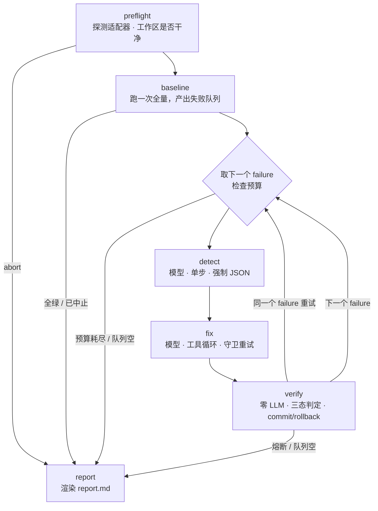

# 架构：一次 `aifix run` 是怎么转的

这份文档回答一个问题：**从「一个失败的测试」到「一条经过验证的补丁分支」，中间到底发生了什么，每一步读什么状态、写什么状态。**

想知道它凭什么敢跑在你自己的仓库上，看[安全边界](safety.md)；想知道它怎么证明自己有用，看[评测](evaluation.md)；出了问题怎么查，看[诊断](diagnostics.md)。

---

## 核心主张

**只有零 LLM 的确定性代码有资格说「修好了」。**

判定不看模型怎么说自己，只看跑测试比较失败集：`verify` 节点跑一次全量、过滤抖动、做三态判定（BETTER / SAME / WORSE），按判定 commit 或 rollback。模型负责生成，harness 负责判定、约束、记账。

三态判定的全部实现在 `src/aifix/verify.py`，18 行，没有任何模型调用：

- 出现**任何**新失败 → `WORSE`（比「净改善」保守，但这是敢在真实 repo 上跑的前提）
- 目标用例从失败集里消失且没有新失败 → `BETTER`
- 其余 → `SAME`

---

## 流程



产品入口是 `cli.run_once`（`src/aifix/cli.py`），它按状态图的语义顺序手工驱动这六个节点。

---

## 两层状态，互不知道对方

**宏观层**：`AifixState`（`src/aifix/graph.py`）是一个 `TypedDict`，装的是**跨 failure 的进度** —— 队列、当前用例、第几次尝试、累计花销、结果列表、中止原因。

**微观层**：单次 `AgentLoop` 内部的状态（消息历史、工具调用、步数、上下文压缩）由 `ai-harness-framework` 自己管。

两层不互相引用。`AifixState` 里唯一与框架有关的字段是 `_failures` 和 `_trace`，下划线前缀表示它们**不参与路由判断**，只是数据源与观测出口。

值得单说的两个字段：

- `signals` 是**列表**不是单个 dict。核心循环对 baseline 里每个 failure 各跑一轮 `verify`，而报告在整个 run 结束后才渲染 —— 单个 dict 会被后一轮整个替换掉，多 failure 时报告只剩最后一个补丁的信号。
- `failure_usd_budget` 的 `None` 与 `0.0` **语义不同**。`None` 是「不设美元闸」，`0.0` 是「额度已扣光，一次调用都不许发起」。`fix_node` 因此必须用 `is None` 判定 —— 写成 `state.get(...) or None` 的话，`0.0 or None` 求值成 `None`，恰好把闸最该拦住的那一刻变成完全不拦。

---

## 节点逐个说

### `preflight` — 零 LLM

`src/aifix/nodes/preflight.py`，53 行。

- 校验测试解释器：`AIFIX_TEST_PYTHON` 显式配了一个不可执行的路径就当场中止。放在这里而不是留给 baseline，是因为到了那一步失败的表现是「没写出 JUnit 报告」，中止消息会说「测试进程没能正常跑完」—— 一句指向**目标项目**的话，而真相是 aifix 的配置写错了
- 探测适配器：走 `baseline.detect_adapter`，**全项目唯一的探测入口**
- 确认主工作区干净：`delivery.ensure_clean`，只看**已跟踪**文件（`git status --porcelain --untracked-files=no`）

只看已跟踪文件是有意的：worktree 从 HEAD 创建，主工作区的 `__pycache__`、`.venv`、编辑器临时文件根本进不去 agent 的工作区，为它们中止会让任何跑过一次测试的项目直接用不了这个工具。而已跟踪文件的修改必须拦 —— baseline 从 HEAD 算出，工作区另有改动的话，算出来的失败集合和用户眼前看到的对不上。

任一不满足即 `abort`，直接跳到 `report`。

### 建 worktree 与 trace（在 `run_once` 里，不是节点）

- 产物目录：`<repo>/.aifix/runs/<run_id>/`
- `RunTrace` 打开 `events.jsonl` / `facts.jsonl`
- `Worktree` 上下文管理器：`git worktree add -b aifix/<run_id> <repo>/.aifix/runs/<run_id>/tree HEAD`

退出时 `git worktree remove --force`，**但保留分支** —— 分支是交付物。

### `baseline` — 零 LLM

`src/aifix/nodes/baseline.py`。跑一次全量测试，解析 JUnit XML，同时产出 id 列表与 `Failure` 对象。

**整个 run 只跑这一次**。全量测试很贵，后续每轮 `verify` 各跑一次，那是判定必需的成本。

跑之前先做一次近似探测（`warn_if_patch_may_be_invisible`）：拿测试解释器问一句「worktree 里这些顶层包会从哪个文件导入」，凡是解析到 worktree **之外**的就往 stderr 打警告并在 trace 里记一条事实。它要挡的是「目标项目把自己可编辑安装进了那个解释器，于是每一轮验的都是源仓库里没打补丁的代码」——测试照绿、结论是假的。只报警不拦截，理由与边界见[适配器](adapters.md#换来的真实风险可编辑安装会让验证悄悄失效)。

跑完解析出 id 之后还有一道闸（`collection_error_abort`）：baseline 里**文件级收集错误**占比过高（条数 ≥ 2 且严格过半）时中止整个 run，`abort_kind = "collect"`。`require_report=True` 只拦得住「一份报告都没写出来」；报告写出来了、里面却全是「某个测试文件没能导入」，是另一条缝 —— 那些 error 会被翻译成可重跑的 node id 排进队列，然后模型被派去修「这台机器上缺了点什么」。判据、阈值取舍与绕过办法见[安全边界](safety.md#baseline-全是收集错误collect-中止)。

写入：`baseline_ids`、`queue`、`_failures`、`abort`、`abort_kind`。中止时 `queue` 清空而 `baseline_ids` **照旧写**：它是这一跑的真实测量，不可信的是「拿它当工单」这个动作。

随后 `run_once` 做两件事：`--test` 把队列过滤到只剩一个用例；`--dry-run` 把队列清空（不调用任何模型，接一个陌生项目时先看清工作量）。

### 主循环的预算闸

`RunBudget`（`src/aifix/budget.py`）在这里建立并 `start()`。每轮循环开头：

1. `current` 为空则从队列 pop 一个，`attempt = 1`
2. `budget.exhaustion()` 越线 → 记 `abort` 与 `abort_kind`、补录在飞的 failure、`break`
3. 算 `failure_token_budget = budget.for_failure(剩余 failure 数)`
4. 开 `failure_span` / `attempt_span`，依次跑 detect → 结算 → 算 `failure_usd_budget` → fix → 结算 → verify
5. 检查连续失败熔断

`detect` 花掉的钱**必须在 detect 返回后立刻结算**，否则给 fix 算出来的额度是按「detect 还没花钱」算的。详见[三层预算](safety.md#三层预算)。

### `detect` — 模型路由一

`src/aifix/nodes/detect.py`，55 行。

- 客户端：`OpenAICompatibleClient(cfg.detector)`
- 工具面：**空的 `ToolRegistry()`** —— 模型必然一步出文本
- `max_steps=1`，`json_output()` 强制 JSON
- token 闸：`BudgetTracker(max_tokens=cfg.detector_max_tokens)`，默认 20,000

输入是 `Failure`、`adapter.locate_source()` 从栈帧还原的嫌疑位置，以及**前三个候选位置周围的真实源码**（`src/aifix/snippet.py` 的 `around()`，上下各 12 行，带文件里的真实行号，栈帧指向的那行用 `>` 标出）。输出解析成 `Diagnosis`（`suspect_file` / `suspect_lines` / `root_cause` / `fix_strategy` / `confidence`）。

源码是 2026-07-31 加的，零 LLM、不多花一个回合。在那之前 Detector 判断「根本原因是什么」时看到的只有路径、行号和 traceback —— 那段代码它从未见过，`suspect_lines` 只能编。而编出来的行号会原样进入 Fixer 的开场白（「嫌疑行号：120-135」），把它的第一步引向一个具体而错误的位置。**读不到源码时 prompt 明确要求填 `null`**：不给是「不知道」，编一个是「指错地方」，后者更糟。

工具面仍然是空的、仍然单步 —— 那个设计是对的（一次调用、成本可预测）。缺的从来不是工具，是事实。

**解析失败降级为 `diagnosis=None`，不是错误** —— `fix` 会改为把原始 traceback 直接交给 Fixer 自行判断。

写一条 `suspect_in_traceback` 事实：模型点名的文件是否落在 traceback 指出的候选里。**这不是评测的 `locate_hit`** —— 那个对 ground truth 判定、由评测计算。两者是不同的集合（异常常在下游抛出而缺陷在上游），共用一个名字会让评测悄悄量成「模型有没有照抄 traceback」。

### `fix` — 模型路由二

`src/aifix/nodes/fix.py`，245 行。

- 客户端：`OpenAICompatibleClient(cfg.fixer)`
- 沙箱：`LocalSandbox(workspace=worktree_path)`
- 工具面：白名单七个 —— `read_file` / `read_symbol` / `list_files` / `grep` / `edit_file` / `apply_patch` / `run_tests`，**没有 shell**。改代码首选 `edit_file`（给原文与新文，不用数 diff 行号）；两条写入路径共用 `tools/guard.py` 的守卫
- `max_steps=cfg.fixer_max_steps`，默认 25

跑完 `AgentLoop` 之后检查改动是否合理，两条守卫（空 diff、巨型 diff）以**带反馈重试**的方式处理，而不是直接失败。守卫重试**不计入 `attempt`** —— `attempt` 衡量的是「修复尝试」，而守卫触发时连一次有效尝试都还没产生。

守卫、能力面、预算的细节全部在[安全边界](safety.md)。

### `verify` — 零 LLM，系统里唯一有资格说「修好了」的地方

`src/aifix/nodes/verify.py`，204 行。

1. 跑一次全量
2. **过滤抖动**：只在出现新失败时触发重跑，且只重跑那几个用例。成本近似为零，却能挡掉绝大部分因抖动导致的误回滚 —— 把一个本来正确的补丁滚掉，是这个系统最昂贵的错误
3. 把判为抖动的用例从当前结果里剔除，再做三态判定
4. **一个字节都没改却判 BETTER** → 降级成 `SAME`，记一条 `baseline_flaky`。说明目标用例在 baseline 里本来就是抖的；放任不管的话系统会宣称修好了一个它没碰过的 bug
5. 算静态信号（必须在 commit / rollback 之前 —— 那时补丁还在工作区，旧内容只能从 HEAD 拿）
6. 判 BETTER 则 `wt.commit(paths=touched)`，**它的返回值参与判定**：返回 `False`（暂存区为空，补丁被自己的反向补丁抵消了）就降级成 `SAME`；抛 `RuntimeError`（`git add` 失败）就接住、降级成 `SAME`、记 `delivery_failed`
7. 非 BETTER 则 `wt.rollback()`

第 6 步的判据是「提交有没有真的产生」，不是提前用 `git diff` 去猜：git diff 看不见未跟踪文件，而新建一个源文件是完全合法的修复，按 diff 判会把它误降级。

一轮没修好且 `attempt < max_attempts`（默认 3）就把 `attempt` 递增后回到 `detect`，同一个 failure 再来一次。

### `report` — 零 LLM

`src/aifix/nodes/report.py`，137 行。渲染 markdown，落盘到 `<artifact_dir>/report.md`，同时写进 `state["report_md"]`。

一个都没修好时**不给合并命令** —— 那条分支与 HEAD 逐字相同，`git merge` 是在邀请用户去合一个空分支。

真实输出（`aifix run <repo> --dry-run`）：

```
# aifix run 2ace03ce

- 适配器：pytest
- 分支：`aifix/2ace03ce`
- 修复：**0 / 1**
- 成本：$0（0 tokens）

| 测试用例 | 结果 | 尝试次数 | 中止原因 |
|---|---|---|---|

这条分支上没有任何提交（`aifix/2ace03ce` 与 HEAD 相同），没有可合并的东西。
```

---

## 交付：改动全在 worktree 里

主工作区**绝不被触碰**。agent 能看到、能改的只有 `<repo>/.aifix/runs/<run_id>/tree`，那是一个从 HEAD 创建的 git worktree，挂在独立分支 `aifix/<run_id>` 上。

run 结束时 worktree 目录被删掉，分支留下。所以：

- 交付物是**一条分支**，不是一堆文件
- 每修好一个 failure 就是分支上的一个提交（`fix: <test_id>`）
- 没修好的尝试被 `rollback` 丢掉，分支上不留痕迹
- 报告是用户手里**唯一**的成果凭据 —— worktree 已经没了，分支上有什么、下一步该干什么，全写在 `report.md` 里

这也是为什么 `run_once` 的 `except` 块里不吞异常但保证报告先落地：异常裸穿出去的后果不是「报错」而是**失联**，这次 run 前面几个 failure 可能已经把修复提交进交付分支了，而用户只看到一段调用栈。崩溃时记一次 `abort_kind="crash"`、渲染报告、落盘，然后由 `_cmd_run` 以退出码 1 退出。

---

## 两条模型路由

`AifixConfig`（`src/aifix/config.py`）里 `detector` 和 `fixer` 各是一个独立的 `HarnessConfig`：

```bash
export AIFIX_DETECTOR__MODEL=...      # 定位用的模型
export AIFIX_FIXER__MODEL=...         # 修复用的模型
export AIFIX_FIXER__BASE_URL=...      # 端点也可以不同
```

嵌套环境变量用 `__` 分隔（`env_nested_delimiter="__"`）。两条路由可以指向完全不同的端点和模型 —— 定位是一次无工具的单步 JSON 推理，修复是一段带工具的多步循环，两者对模型的要求本来就不一样。

---

## issue 驱动：在 `run_once` 之前多一步，之后什么都没变

M6 之后 `run_once` 不再是唯一入口。`aifix issue handle` 在它**之前**插了一段，而**核心循环一行都没改**：

```
读 issue 事件 → 授权（零 LLM）
  → reproduce   模型路由三（复用 fixer 的配置）：读代码，写一条复现测试
  → red_check   零 LLM：必须红，且不能红在收集错误上
  → git commit  复现测试进 HEAD
  → run_once(only_test=<那条复现测试>)      ← 从这里开始与上面完全一致
  → git push + 开 PR
```

关键在 `git commit` 那一步：`Worktree` 是从 **HEAD** 建的，所以复现测试自然出现在 worktree 里，`baseline` 把它认成一个普通的失败用例，`only_test` 把队列削成只有它。**核心循环完全不知道自己在被 issue 驱动。**

交付分支上因此天然有两个提交（复现测试、修复），PR 的 diff 一屏看完 —— 而「报告说已修复时分支上必须真的有东西」这条主张，在这里额外多了一层证据：那条测试本身就在分支上。

`reproduce` **不在图里**，所以它不在 `nodes/` 下而在顶层 `src/aifix/reproduce.py`。它必须发生在 `run_once` 之前（测试要先进 HEAD），而图的入口就是 `run_once`。

细节与七条设计决策见 [M6 计划](superpowers/plans/2026-07-29-m6-issue-driven.md)。

## `run_once` 与 `build_graph()` 不等价

`graph.build_graph()` 用 LangGraph 装配了同一套节点与路由，节点是 trace 的单位，也是 checkpoint 的边界。但**两条路径不等价，预算只在 `run_once` 里**。

`RunBudget`、`failure_token_budget` 与 `failure_usd_budget` 的分配、以及「越线即中止」的检查全部写在 `run_once` 这个函数里。`build_graph()` 那条路径没有 `RunBudget`，`failure_usd_budget` 一直是 `None`，**整条美元闸不存在**。

产品入口走 `run_once`，图那条路径目前只用于结构验证。**别拿它去验证任何与花钱有关的保证。** 这段话逐字来自 `cli.run_once` 的 docstring。

断点续跑（`AifixConfig.enable_checkpoint`，默认关）走 LangGraph 的 `SqliteSaver`，会在产物目录下留一个 `checkpoint.sqlite`。

---

## 相关文档

- [安全边界](safety.md) —— 四层封闭、守卫、三层预算
- [评测](evaluation.md) —— 任务集怎么来、成绩怎么算
- [诊断](diagnostics.md) —— 产物布局、回放、跨 run 统计
- [适配器](adapters.md) —— 怎么支持一门新语言
